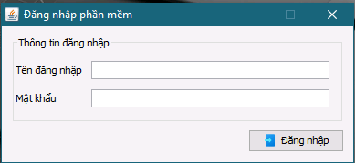
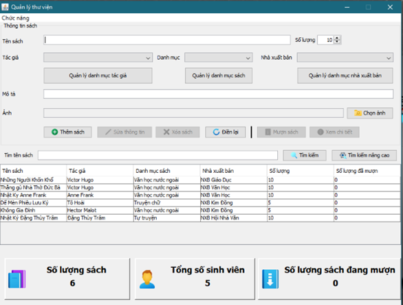
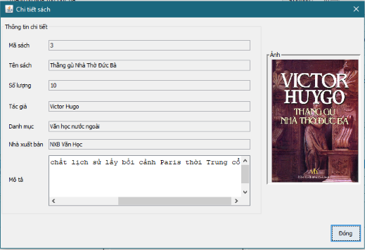
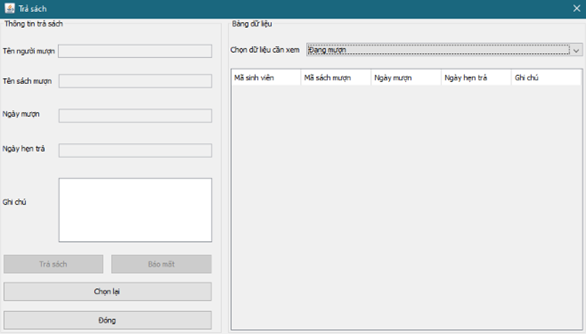

# Chào mừng
Đây là repo của Project thứ 2 tại Aptech, với đề tài là xây dựng một chương trình ứng dụng viết bằng Java.

# Chức năng chương trình
Hiện tại chương trình có những chức năng sau:

Với thủ thư:
 
 - Đăng nhập, đăng xuất phần mềm
 - Xem, tìm kiếm các đầu sách đang có tại thư viện, phần mềm hỗ trợ tìm kiếm theo tên sách.
 - Tìm kiếm nâng cao cho phép tìm kiếm theo danh mục sách, nhà xuất bản, tác giả
 - Quản lý thông tin các đầu sách bằng các chức năng có sẵn
 - Xem, và cập nhật thông tin mượn sách, trả sách của sinh viên
 - Đổi mật khẩu đăng nhập của người dùng

 Với quản trị viên, ngoài các quyền được nêu phía trên, quản trị viên còn có thêm những quyền sau:

 - Xem, tìm kiếm thông tin sinh viên.
 - Quản lý, cập nhật thông tin sinh viên
 - Quản lý thông tin các danh mục sách, tác giả, nhà xuất bản
 - Quản lý thông tin đăng nhập, đặt lại mật khẩu người dùng đăng nhập phần mềm

 # Cài đặt môi trường

 Để cài đặt Project lên máy tính cá nhân, đảm bảo máy tính cá nhân có những phần mềm sau, lưu ý là những link ở đây sẽ giả sử hệ thống đang dùng Windows:

 - [XAMPP](https://www.apachefriends.org/index.html) : Project sử dụng môi trường MySQL được cài đặt sẵn trong XAMPP.

 - [NetBeans 8.2](https://drive.google.com/file/d/1ROjHav5eodUgaglLg3WmGCdT8ohpCRJL/view?usp=sharing) : IDE chủ yếu được dùng để tạo phần giao diện đồ họa (GUI) của Project . Trước đây Oracle có cung cấp download cho phiên bản được sử dụng cho Project, nhưng hiện tại đã không còn, link được đặt ở đây sẽ dẫn đến Google Drive cá nhân để download bộ cài đặt.

 - [VSCode](https://code.visualstudio.com/) : (Tùy chọn, có thể cài đặt hoặc không) Phần mềm các thành viên trong nhóm sử dụng để code Project. Tuy nhiên, để VSCode có thể hỗ trợ ngôn ngữ Java, thì ngoài bộ Extension hỗ trợ của VSCode , vui lòng cài đặt thêm [JDK phiên bản 11 trở lên](https://adoptium.net/). Bạn có thể đọc [issue này](https://github.com/redhat-developer/vscode-java/wiki/JDK-Requirements#setting-the-jdk) để biết lý do của yêu cầu này.

# Một số ảnh chụp màn hình Project

Dưới đây là một số ảnh chụp màn hình của Project:

 - Giao diện phần đăng nhập phần mềm:

- Giao diện chính, đồng thời là giao diện quản lý sách của phần mềm:

- Giao diện hộp thoại xem chi tiết sách:

- Giao diện phần trả sách:

# Các nguồn tham khảo

Project có sử dụng những thư viện, icons ở các nguồn sau:

Thư viện sử dụng trong Project:

 - [Apache Common IO](https://commons.apache.org/proper/commons-io/download_io.cgi)

 - [Apache Common Lang](https://commons.apache.org/proper/commons-lang/)

 - [Oracle MySQL Connector](https://mvnrepository.com/artifact/mysql/mysql-connector-java/8.0.27)

Icon của phần mềm được lấy từ [Bộ Icon Fluency từ Icons8](https://icons8.com/icons/fluency) lấy cảm hứng từ [Fluent Design](https://www.microsoft.com/design/fluent/#/) của Microsoft

Ngoài ra, một số đoạn code sử dụng trong Project được tham khảo ở một số nguồn sau:

https://stackoverflow.com/questions/16343098/resize-a-picture-to-fit-a-jlabel/16345968

https://stackoverflow.com/questions/1146153/copying-files-from-one-directory-to-another-in-java

https://www.geeksforgeeks.org/md5-hash-in-java/
